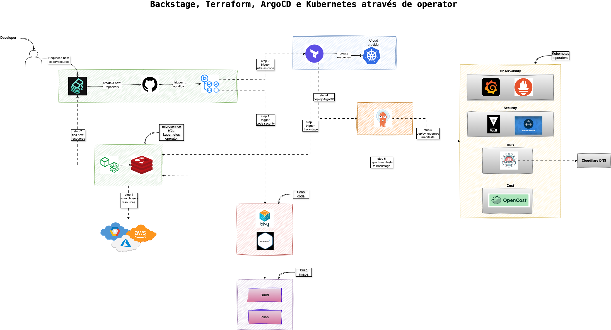

# Seja bem vindo!

Muito obrigado por estar nos visitando, esperamos que seja uma boa experiência todos os testes aqui executado.

## Introdução

Esse é um serviço que oferecemos, plataforma como serviço.

Plataforma como serviço, é onde você gerência todas as suas padronizações de código, nomeclatura, tem a visualização do status do ambiente, documentações, documentações de API e status dos recrusos de cloud. Essas são algumas das opções básicas que a plataforma como serviço oferece.

Nesse espaço, vamos te oferece uam experiência única de automação de infraestrutura como código e integração de alguns microserviços.  Para você desfrutar dessa experiência, acesse o template que te guiará nos próximos passos [template](https://platform-demo.synera.com.br/create/templates/default/plataforma-orchestration).

## Fluxo de trabalho

Na imagem abaixo, você encontrará o nosso fluxo de trabalho e nesse momento você é o desenvolvedor acessando o Backstage.

Cada estrutura tem uma proposta de ficar 30 minutos ligada e depois é automaticamente destruída. E cada usuário pode provisionar 1 estrutura por dia.

Nosso fluxo de trabalho inclui as seguintes ferramentas, no qual podem serem trocadas conforme a necessidade de cada cliente:

* Backstage: interface geral de acesso dos desenvolvedores em geral;
* GitHub: nosso serviço de repositório de código;
* GitHub Workflow: estrutura de CI/CD que estamos utilizando e nesse caso, mais voltado para o CI;
* Terraform: ferramenta que iremos utilizar para provisionar os recursos de cloud;
     - Kubernetes
     - Load Balancer
     - Key Vault
     - ArgoCD
* ArgoCD: nosso ferramenta de entrega de software no Kubernetes, tendo diversas integrações;
* Microserviço: esse nosso serviço é responsável por fazer um SCAN na cloud, logo após o Terraform provisionar os recursos;
* Backstage: novamente, chegamos ao Backstage onde, após finalizar o fluxo, todos os recursos e menifestos deve aparecer para você.

Esse é um fluxo que preparamos como demonstração inicial, e como refrênciado anteriormente, podemos substituir algumas ferramentas no meio do caminho, conforme a necessidade de cada cliente.

